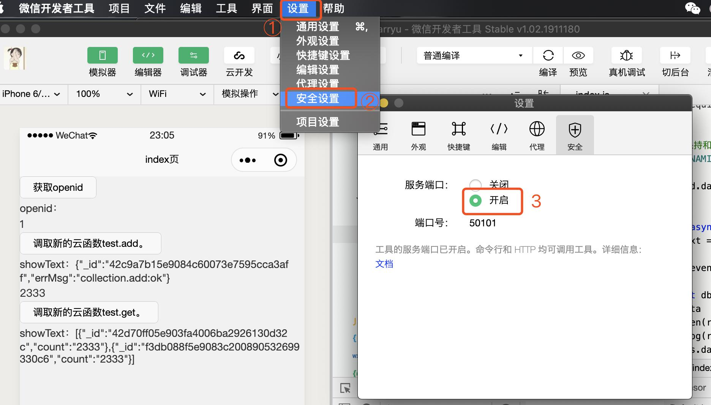
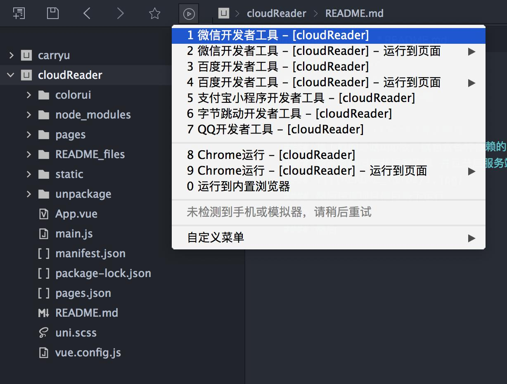
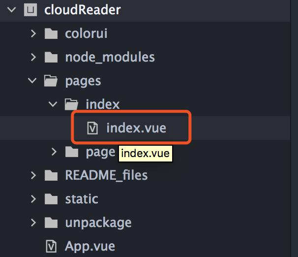
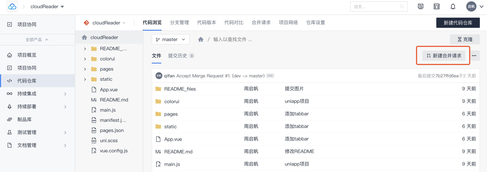
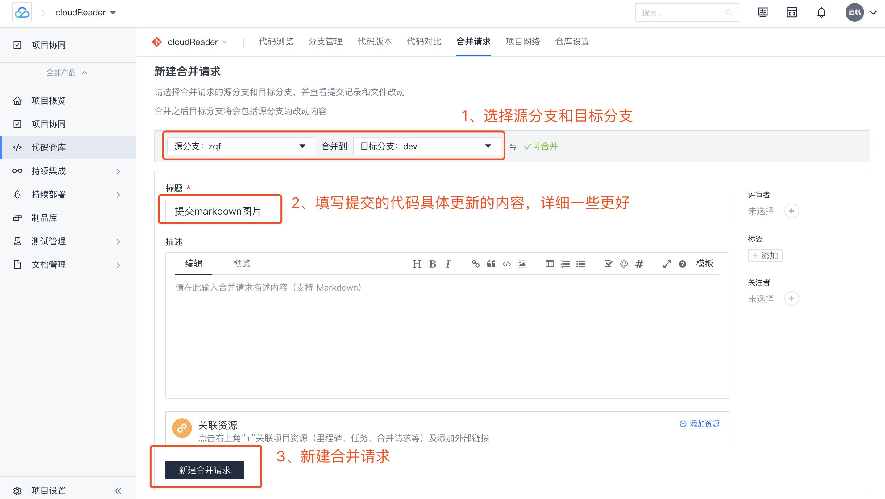
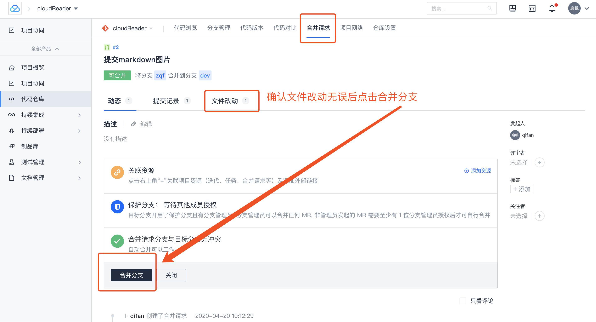
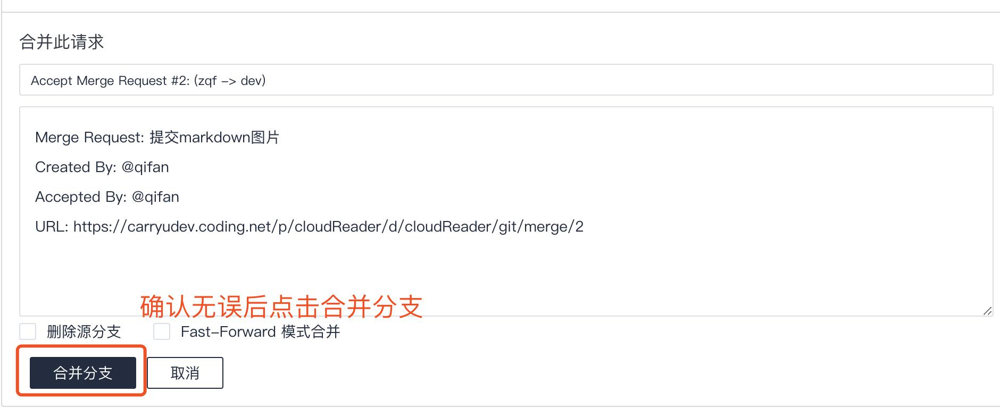
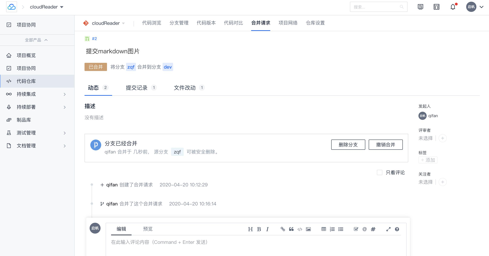

### cloudReader
### 立项时间 2020/4/3
### 成员： 凢凢，启帆，刘振

### 一、使用HBuilderX打开该项目
我下载的是啥app版，就包含各种依赖的
要准备好微信开发者工具 并且开启服务端口
#### 
在该项目根目录下运行
```
npm install
```
选择在微信开发者工具中运行，就会自动打开微信开发者工具了
#### 

云函数的调用方法在这里面写了
#### 
目前是有登陆，增加和查询的调用方法

### 二、提交代码流程
```
// 拉取最新代码合并到本地以保证提交的代码不产生冲突
git checkout dev		// 切换到dev分支
git pull				// 拉取最新代码
git checkout zqf		// 切换到自己的分支
git merge dev			// 将dev上的最新代码合并到自己的分支

// 到这一步没有代码冲突的话就可以开始提交代码了
git status				// 查看文件的变更状态 

//跟踪文件（当前不这么用，因为node_modules还有unpackage也会被跟踪提交,之后优化一下.gitignore再看
git add .				// 提交所有改变的文件

//所以一个一个跟踪一下 分为跟踪单文件和提交整个文件夹的变更
git add <文件名>			// eg：git add README.md
git add <文件夹>/		// eg：git add pages/

>Tips:
	1.文件名可以不写全，输入几个字母之后确认只有该唯一文件后按Tab键会自动补全，不是唯一的话会提示所有同前缀的文件
	2.跟踪完之后用 git status 查看一下文件状态，以免遗漏

// 提交文件并备注
git commit -m ‘(变更的具体内容)’

// 将代码推送到自己的远程分支
// ps：加了参数-u后，以后即可直接用git push 代替git push origin zqf
git push -u origin zqf
```
上面是`git merge`之后没有代码冲突的情况，有冲突的情况之后再补充

上传完代码之后，将自己分支合并至dev，在代码仓库中新建合并请求





